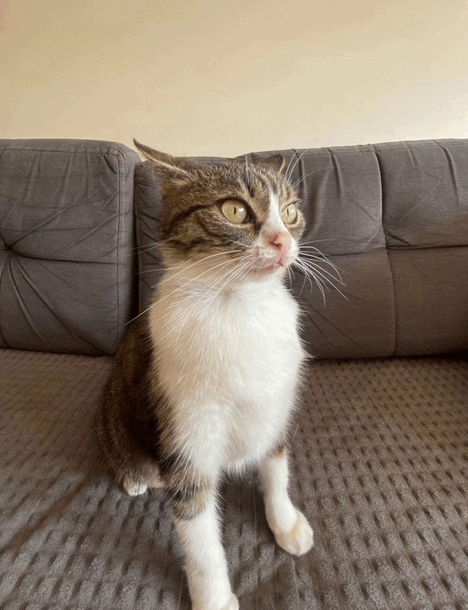
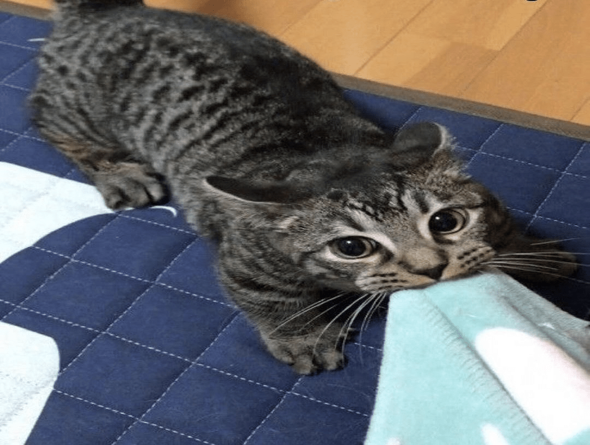
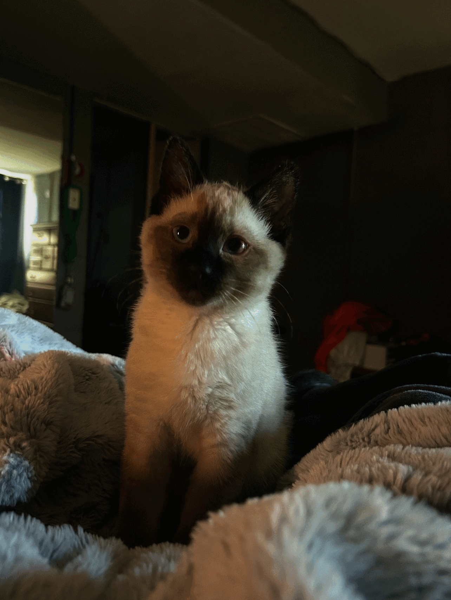
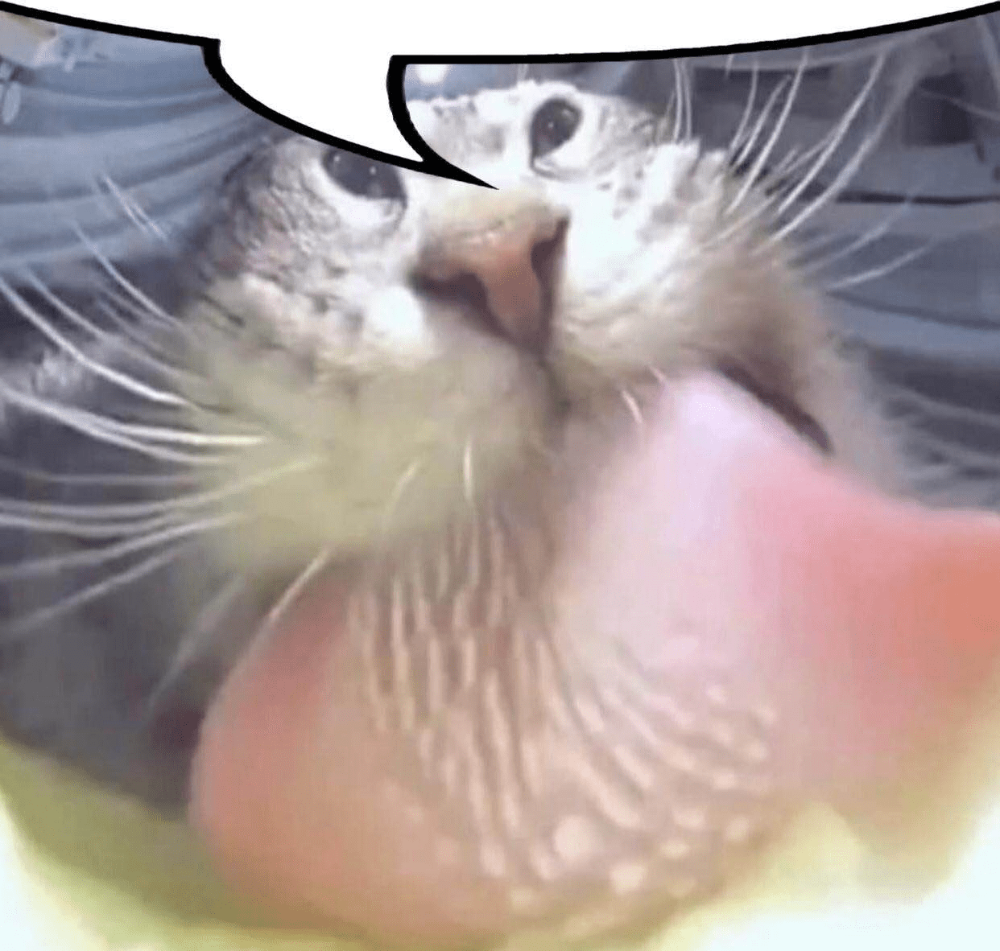
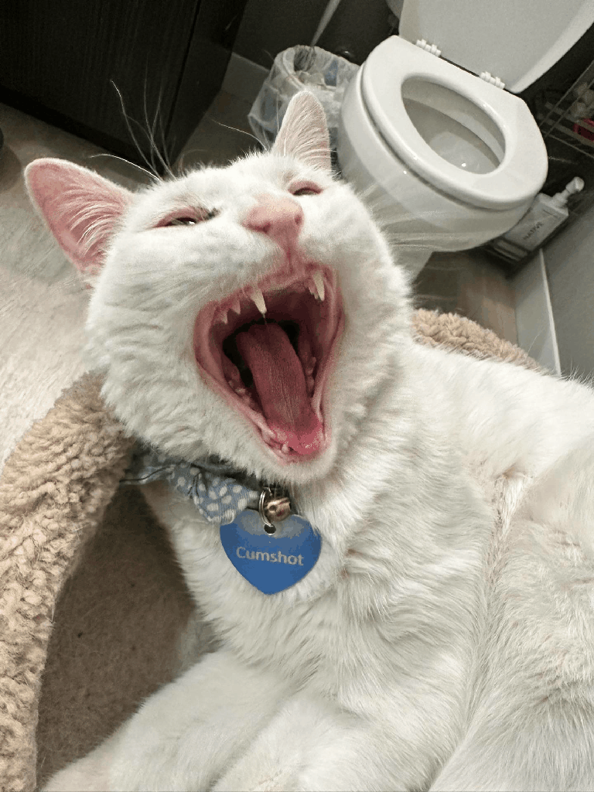
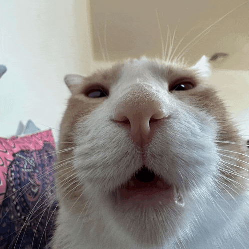

  

<h3 align="center">i love modding</h3>

  i've been messing with games for a while, modding, and decompiling just to see how they work.  
  some mods worked. some broke everything. either way, i learned.

<h3 align="center">games i play</h3>

  
  <a href="https://www.gorillatagvr.com">gorilla tag</a> |  
  <a href="https://rec.net">rec room</a> |
  <a href="https://www.roblox.com/home">roblox</a>

  

---

<h3 align="center">current projects</h3>

  
  <a href="https://discord.gg/vrmods">aa services</a> |
  <a href="https://discord.gg/ccyF7HjzFX">console</a>

  

---

<h3 align="center">languages & tools</h3>

  
  
  
  
  
  
  
  
  

  

---

  
  
  
  
  
  
  
  
  
  
  
  
  
  
  
  

